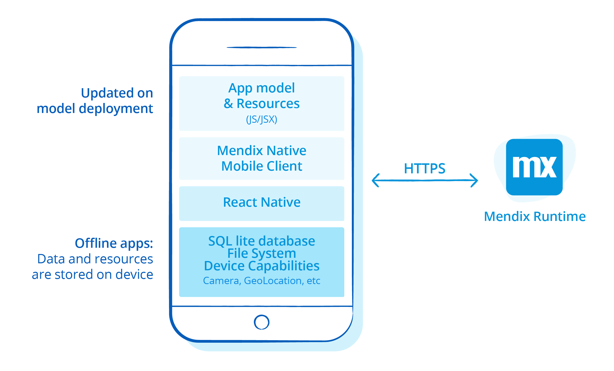
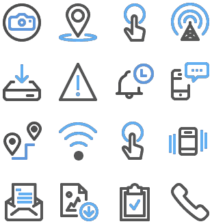

## 1 How Do Mendix Native Mobile Apps Work? {#native-mobile-apps-work}

With Mendix, you can build truly native mobile apps from a single integrated visual development environment.

**This feature is currently in Beta as part of Mendix Studio Pro 8**

Mendix native mobile apps are truly native mobile apps based on [React Native](https://facebook.github.io/react-native/). Native mobile apps differ from hybrid apps: they do not render inside a web view, but use native UI elements instead. This results in faster performance, smooth animations, natural interaction patterns (like swipe gestures), and improved access to all native device capabilities. React native has a large community, containing many high components and modules, enabling customer to build rich native mobile apps with many extension options. For a great user experience, native mobile apps are based on an [offline-first architecture](offline)

{}

{}

In native mobile apps you can reuse the existing domain model and logic. Pages for native mobile are optimized for mobile use, showing only the native mobile widgets and related properties.
These can leverage native device features via mobile-specific actions, controls, transitions, and gestures that are dragged into the page editor when designing rich native user experiences.
Existing pages for web or hybrid apps can be made available for native mobile apps by changing the layout to a native mobile layout. Consistency checks are applied, to make sure no web/hybrid mobile related features are used.

It is possible to add a native mobile app as an additional channel to an existing Mendix application (as discussed in the section [How Does Mendix Support Multi-Channel Applications?](front-end#support-multi-channel) of *Front-End*).

The mobile app connects to the Mendix Runtime server in order to load. This acts as a mobile-back-end-as-a-service (mBaaS) for the mobile app, wherein the communication is automatically handled by Mendix. The mobile app automatically loads everything that is needed at startup and in later use of the app.

{}

{}

**TODO update with right one**

## 2 How Can I Leverage Device Capabilities in My Mobile Apps?
Mendix native mobile apps come out of the box with a rich set of actions to leverage native device capabilities, like the camera, biometric authentication, gps, and bluetooth, but also platform features like sharing data, open the navigation or draft an email. 

{}

{}

Also, native capabilities can be leveraged using widgets for a great UI/UX. You can easily add these widgets to your mobile app projects and configure them in Mendix Studio Pro. 

If other device capabilities are needed, you can extend the project with a custom nanoflow actions or pluggable widgets that wrap [React Native Components or APIs](https://facebook.github.io/react-native/docs/components-and-apis.html) to leverage the device capabilities. For more information see [How Can I Extend the Mendix Front-End?](front-end#extend)

## 3 How Can I Preview & Test My Native Mobile App? {#mxapp-preview}
Native mobile app are directly previewed on the device using the Mendx Make It Native app (available for [Android](https://play.google.com/store/apps/details?id=com.mendix.developerapp) and [iOS](https://docs.mendix.com/howto/mobile/getting-started-with-native-mobile#downloading-for-ios) by scanning the QR code in Mendix Studio Pro or entering IP address manually. When you make a change to your app, and press the run button, the app will be automatically reloaded, making your changes quickly visible while keeping the original state so that you are still on the same page with the same data. This creates a very short feedback cycle. Next to this, you can use a simple three-finger tab to reload the app, for example, after you make changes to the styling.

For more information see this [getting started](https://docs.mendix.com/howto/mobile/getting-started-with-native-mobile).

## 4 How Can I Extend My Native Mobile App? {#how-can-i-extend-my-mobile-app}
You can extend native mobile apps with custom UI components or app logic as described [here](front-end#extend) to leverage any type of visualization, UI/UX or device capabilities.
