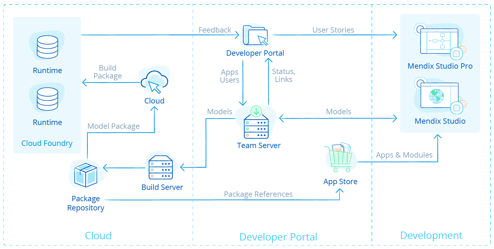

## 1 What Are the Key Components of the Mendix Platform Architecture? {#key-components}

The Mendix Platform is a completely integrated application platform-as-a-service (aPaaS) offering for designing, building, deploying, and managing enterprise apps. The platform is accessible to developers and administrators through the Developer Portal, which provides access to apps as well as services for requirements management, development, and deployment in the operation and administration of apps and app services. The platform includes both Mendix Studio Pro and Mendix Studio as well as the [Mendix App Store](https://appstore.home.mendix.com/index3.html) that features hundreds of publicly available building blocks to speed up development. The Mendix App Store can be configured for private use as well, so that apps and building blocks can be shared across your organization. The platform features online collaboration among users through the Developer Portal, Mendix app, and Mendix Studio and Mendix Studio Pro.

The below diagram provides an overview of the key components of the Mendix Platform.

## 2 What Are the Main Mendix Platform Modules & Services?

The sections below go into more detail about the following main modules and services of the Mendix Platform:

* [Developer Portal](#dev-portal)
* [Mendix Studio and Mendix Studio Pro](#studios)
* [Team Server](#team-server)
* [Build Server](#build-server)
* [MxID](#mxid)
* [Deployment via the Developer Portal](#cloud)
* [App Store](#app-store)

### 2.1 What Is the Developer Portal? {#dev-portal}

The Mendix Developer Portal is a collaborative environment for the design, development, and deployment of apps. This web-based portal comes with online social collaboration features (via the **Buzz**), a notification service, and a directory of active members in your company who could be invited for participation in app projects as well as for social collaboration.

The Developer Portal is where you do most of your requirements management and tracking according to the Scrum methodology. You can define Sprints and stories, follow the progress, and see the velocity for your project. The is hosted on the Mendix public cloud running on AWS.

### 2.2 What Is Mendix Studio and Mendix Studio Pro? {#studios}

[Mendix Studio Pro](https://docs.mendix.com/refguide/modeling) and [Mendix Studio](https://docs.mendix.com/studio) are the multi-user modeling IDEs of the Mendix Platform. The general purpose of the Mendix Studios is to provide an integrated, unified modeling space, where business analysts, and IT engineers can work closely together to model the various application elements. Mendix Studio Pro runs locally on the developer’s computer and has an integrated build service for working fully offline, while Mendix Studio is hosted on the [Mendix Cloud](../app-capabilities/mendix-cloud-overview).

### 2.3 What Is the Team Server? {#team-server}

The Team Server is the central repository for managing and versioning application models. Team Server is written as an extension on top of Subversion (SVN), a widely adopted open-source software configuration management system. The Team Server may be hosted in Mendix Cloud or deployed on-premises.

For more information, see [Version Control & Multi-User Development](../app-lifecycle/version-control).

### 2.4 What Is the Build Server? {#build-server}

The Build Server creates deployment packages from artifacts (such as models, style sheets, and custom Java classes) in the app project on the Team Server, where all the application artifacts are versioned and stored in project folders. The Build Server is triggered by the Developer Portal or from the Mendix Runtime. The Build Server also performs package validation and determines if the specific build is a deployable package.

### 2.5 What Is MxID? {#mxid}

MxID is a user-management and provisioning service that applies the OpenID standard. It can be integrated with active directory and single sign-on (SSO) protocols. MxID provides a login server for the Developer Portal, which is the central access portal for Mendix apps.

Furthermore, MxID provides an administration portal for the management of companies and app users.

### 2.6 What Is Deployment via the Developer Portal? {#cloud}

Deployment via the [Mendix Developer Portal](../app-capabilities/mendix-cloud-features#cloud) enables you to manage environments and configurations as well as to deploy apps to the cloud with a single click and manage and monitor their performance. The Developer Portal is the interface to the deployment services layer in the platform. Mendix also offers interfaces for deploying to the [SAP Cloud Platform](../app-capabilities/strategic-partner-cloud#running-sap-cloud) and [IBM Cloud](../app-capabilities/strategic-partner-cloud#ibm-cloud).

### 2.7 What Is the Mendix App Store? {#app-store}

The [Mendix App Store](https://appstore.home.mendix.com/index3.html) is a public marketplace for apps and application building blocks. This App Store can also be configured to serve as a private enterprise app store, so that end-users and business managers can discover what apps are accessible to them within their organization.

For more information, see [App Store](../app-lifecycle/app-store).
